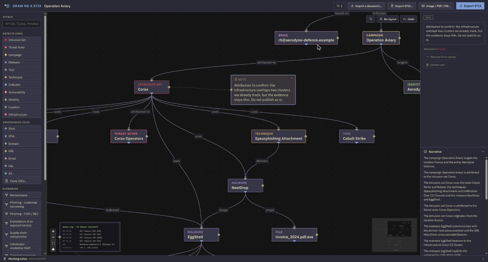

# Draw Me A STIX

> *"If you please… draw me a STIX."*

**The CTI analyst's STIX scratchpad.** A **local-first** investigation canvas, somewhere between Maltego and a whiteboard, whose output is a clean **STIX 2.1 bundle**, importable straight into [OpenCTI](https://github.com/OpenCTI-Platform/opencti) without creating duplicates.

Everything runs in your browser. The server holds code, never data.

*(formerly "Stixit"; some internal identifiers keep the old name: the `STIXIT_EXTENSION_ID` STIX extension, the IndexedDB database, the enricher's environment variables)*

## Why

- CTI platforms (OpenCTI, MISP) are where **shared truth** lives, not drafts, hypotheses and working notes.
- Automatic extraction tools (Stixify, txt2stix) produce STIX with **no human curation**.
- Maltego discovers, but exports pictures, not structured intel.

Draw Me A STIX fills the gap: **structure, annotate, curate** an investigation on a canvas, then walk away with machine-readable intel.

## What it does



- **A guided canvas.** Drag a link between two objects and only the relationships the STIX 2.1 matrix allows are offered, each with a sentence saying what it means. When no direct link exists (an actor and an IP address, say) it offers the canonical detour rather than a meaningless `related-to`.
- **A triage tray.** Paste a report or a list of IOCs and everything lands sorted by type. Nothing reaches the canvas without your approval, and nothing you reject is lost: it is undoable.
- **An annotation layer.** Pinned notes and screenshots pasted with Ctrl+V, tied to an object by a dashed line. Never exported in the bundle: they are your reasoning, not intel.
- **Deterministic export.** Identifiers derive from each object's own properties, so re-importing the same object updates it instead of creating a second one. Two exports of the same state produce the same file, byte for byte, which is what makes the "unexported changes" indicator trustworthy.
- **Other ways out.** The graph read back as prose, plus PNG, JPG, PDF and Markdown for the humans who will read your report.
- **Keyboard first.** `Ctrl+K` for the command palette, `?` for the shortcut memo, `/` to search the canvas, `Ctrl+Z` to undo a deletion.
- **A STIX guide** at `#/guide`, built from the relationship matrix itself, for whoever has never touched the format.

No account, no telemetry, no LLM anywhere near your intel.

## Quick start

```bash
git clone https://github.com/pakdekro/DrawMeAStix.git drawmeastix
cd drawmeastix
docker compose up --build
```

Then open **http://localhost:8000**. There is nothing to configure and no account to create: the app is a static site, and every investigation lives in your browser's IndexedDB.

Any static host works too: `cd frontend && npm run build`, then serve `frontend/dist/`.

> **Serve it over HTTPS, or reach it through localhost.** Browsers restrict the Web Crypto functions this tool is built on to secure contexts, so an instance opened at `http://192.168.1.10:8000` from another machine cannot record or export anything. `localhost` counts as secure even without TLS, which is why the quick start above works; anything else needs a reverse proxy terminating TLS in front of the container, or a tunnel (`ssh -L 8000:localhost:8000 you@the-host`). The application says so on its own front page rather than failing at the first click, and the container behind the proxy keeps receiving plain HTTP, which is expected.

> **Backups are your job.** Investigations live in the IndexedDB of one browser profile on one machine. Export the bundle (a single JSON file) to archive, to share, or to move to another workstation. Importing it restores the investigation identically, fingerprint included. **The export *is* the save file.**

### Optional: the enrichment sidecar

Passive enrichment (DNS, whois, subdomains, certificate transparency, ASN, CVE descriptions) runs in a **separate container you choose to start**:

```bash
cp .env.example .env      # set ENRICHER_TOKEN
docker compose --profile enrich up
```

Then point the app at it in Settings. **With no endpoint configured, the application cannot make a network call at all**, and that is enforced by the code, not by policy.

## Design principles

1. **Local-first, TLP-safe by construction.** The whole application runs in the browser: STIX logic in TypeScript, storage in IndexedDB. The server only ever serves static files, so your TLP:AMBER and TLP:RED drafts never touch it. One public instance can serve several CERTs without a single byte of their data transiting.
2. **No knowledge base.** Each investigation is a disposable silo; truth lives in your TIP. Draw Me A STIX is the step before.
3. **Deterministic, never an LLM.** STIX IDs are generated with OpenCTI's own algorithm (UUIDv5, checked against `pycti` in CI): importing twice does not create duplicates. Same state ⇒ same bundle ⇒ same version fingerprint.
4. **The investigation file *is* a STIX bundle.** Canvas layout and metadata live inside a STIX 2.1 extension: sharing an investigation means sending the very file you would import into OpenCTI.
5. **The canvas stays curated.** Every automated source (report extraction, enrichment) lands in a triage tray. Nothing reaches the graph without the analyst approving it.
6. **Notes are intel.** A sticky note on an entity becomes a `note` object; an attribution doubt becomes an `opinion`. Exports are validated against the official OASIS JSON schemas before they leave.

## Architecture

```
┌────────────── the analyst's browser ─────────────┐      ┌── server ───┐
│  React + React Flow (canvas, guided forms)       │      │             │
│  TypeScript STIX core:                           │ ◄──  │  nginx      │
│  ├─ deterministic IDs (golden pycti vectors)     │ code │  (static)   │
│  ├─ relationship matrix, bundle builder,         │ only │             │
│  │  importer, sha256 fingerprint                 │      └─────────────┘
│  ├─ OASIS validation (ajv, vendored schemas)     │
│  └─ IndexedDB storage (never server-side)        │   (optional
└──────────────────────────────────────────────────┘    enrichment sidecar)
```

`backend/` is **not** an application: it is the **reference STIX library** (stix2 + pycti) that generates the golden vectors (`backend/scripts/generate_golden_*.py`) and proves the TypeScript core reproduces the Python implementation bit for bit. It never runs in production, only in development and CI.

## How portable is the STIX it produces?

Exports are **conformant STIX 2.1**: every bundle is validated against the official OASIS JSON schemas (`frontend/src/stix/schemas/`, 41 vendored files) before it is offered for download. Anything that reads STIX 2.1 can consume it: threat intelligence platforms, TAXII servers, or plain `stix2`.

**Standard, therefore valid everywhere:**

- the objects themselves (SDOs, SCOs, relationships, `note`, `opinion`, `report`/`grouping`);
- `confidence`, `created_by_ref`, TLP markings, `labels`, `aliases`;
- the identifiers: `type--uuid`, however the UUID was computed.

**Ecosystem convention, never invalidating the bundle:**

- **deterministic identifiers** (UUIDv5 over the distinguishing properties, OpenCTI's algorithm, locked down by golden vectors taken from `pycti`). The spec *recommends* UUIDv4 for SDOs but mandates nothing: a third-party tool takes these identifiers like any others. The benefit is universal, since two exports of the same content yield the same identifier and therefore no duplicates, and it is greatest on platforms that deduplicate on them;
- `x_opencti_location_type` on locations: a custom property (`x_` prefix, conformant) carrying something STIX 2.1 does not model ("this is a country / a city / a region"). Tools that ignore it are left with a perfectly valid `location`;
- the **layout extension** (`extension-definition--4a3b8e1c…`) storing node positions on the canvas: a bona fide STIX 2.1 property-extension, ignored by anything that does not know it.

**Merge behaviour on import** is the platform's business, not the format's: whether an existing field is updated, overwritten or merged comes down to its configuration. That is why the export lets you pick a `confidence` and an author, and never writes an empty field, so it cannot degrade existing data anywhere.

> Interoperability verified against a real **OpenCTI** (7.26): creation, re-import idempotence, no overwrite of a field by a lower confidence, multi-valued field merging, and the identifiers of every observable recomputed identically on the platform side. Other platforms have not been tested; the format, however, is the same for everyone.

## Development

You need **Node 22** for the application, and **[uv](https://docs.astral.sh/uv/)**
only if you touch the reference STIX core or the enrichment sidecar. That is
what the CI uses, so it is enough.

```bash
# Frontend (= the application)
cd frontend
npm install
npm run dev           # http://localhost:5173
npm test              # vitest: golden pycti, roundtrip, store, OASIS schemas

# Reference STIX core (dev/CI: golden vectors + regression, no web app)
cd backend
uv sync
uv run pytest         # IDs vs pycti, roundtrip, relationship matrix
uv run python scripts/generate_golden_vectors.py   # after changing ID recipes
uv run python scripts/generate_golden_bundle.py    # after changing the builder

# Datasets shipped with the app (committed, regenerated weekly by CI)
uv run python scripts/build_attack_dataset.py      # ATT&CK Enterprise
uv run python scripts/build_actors_dataset.py      # actor aliases, after ATT&CK
uv run python scripts/build_countries_dataset.py   # ISO 3166-1 (needs iso-codes)

# Enrichment sidecar
cd enricher
uv sync
uv run pytest
```

Sidecar settings are read from the environment. Every variable is documented, with its reasoning, in `enricher/app/config.py`; see `.env.example` for the two that Compose forwards.

## Conventions

- **Language.** **English, everywhere**: the interface, the documentation, the code comments, the commit messages and the test descriptions. No i18n layer either: English is written in place, so there is nothing to maintain twice. The project was written in French to begin with and the rule widened in steps, so `git log` still holds French messages and some suites still have French test descriptions. They are not being rewritten; what gets touched gets translated. Golden-vector fixtures are the one deliberate exception and keep their accented names: they are there to exercise JCS canonicalisation on non-ASCII, and translating them would remove what the test checks.
- **Branches**: `feat/<issue>-<slug>`, `fix/<issue>-<slug>`.
- **Commits**: [Conventional Commits](https://www.conventionalcommits.org/) (`feat:`, `fix:`, `docs:`…), referencing the issue (`#12`).
- **One issue, one pull request.**

## Contributing

[CONTRIBUTING.md](CONTRIBUTING.md) has what you need installed, the checks to
run, and the one step that trips everybody up on a fresh clone. The
[wiki page](https://github.com/pakdekro/DrawMeAStix/wiki/Contributing) is the
long version, for when a check has gone red and you want to know what it was
proving.

Taking part means agreeing to the [Code of Conduct](CODE_OF_CONDUCT.md).

## Reporting a security issue

Privately, please: see [SECURITY.md](SECURITY.md). The interesting attack
surface here is the content the analyst opens: bundles, backups, pasted
documents, not a server.

## History

[CHANGELOG.md](CHANGELOG.md) for what changed and why.

## License

[Apache License 2.0](LICENSE). Permissive, with an explicit patent grant, the thing a legal department looks for before a tool is allowed into an organisation.
